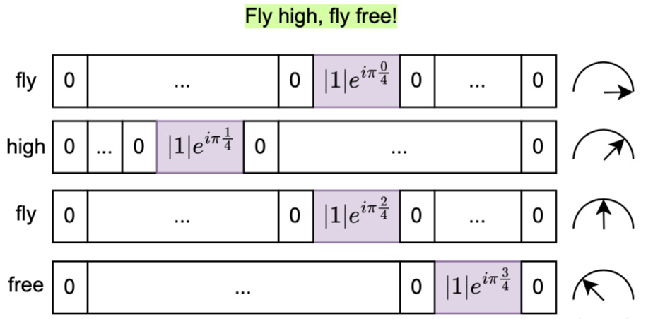

# Comply: Learning Sentences with Complex Weights inspired by Fruit Fly Olfaction
{width= height=y}

- Requirements: `ray==2.38.0, torch`, we ran our code on 4 P100s, 8 A100s.
# Train a model
- Install and follow the FlyVec preprocessing of your data into 2 1D numpy arrays of input ids and sentence offsets.
See [this issue](https://github.com/bhoov/flyvec/issues/4) 


Run the main_dp.py file as in:

```shell
python main_dp.py \
    --encoded_path [path to encoded ids] \
    --offsets_path [path to sentence offsets] \
    --vocab_size 20000 \
    --window_size 11 \
    --K 400 \
    --batch_size 80000 \
    --max_batch_size 80000 \
    --learning_rate 0.0004 \
    --epochs 15 \
    --stride 1 \
    --seed 2025 \
    --complex \
    --no_target \
```

# MTEB 
- Install MTEB, mind the SprintDuplicateQuestions note at the end of `run_mteb.py`, also mind the environmental variables to control for being rate limited by too many requests to huggingface datasets:
```shell
   export HF_DATASETS_CACHE="[path to huggingface datasets cache]"
   export HF_DATASETS_OFFLINE=1
   python run_mteb.py \
    --model_path [path to the pretrained model checkpoint] \
    --k_min 1 \
    --k_max 400 \
    --added_hash \
    --only_benchmark \
```
# WiC
- Get the WiC data, set the hyperparameter search values for ray in the arguments and run
```shell
python WiC.py \
     --num_samples 500 \
     --log_dir [ ray logs run] \
     --model_path [ model checkpoint path] \
     --max_concurrent_workers 6 \
     --min_k 1 \
     --max_k 401 \
     --cpu_per_worker 10 \
     --gpu_per_worker 0 \
     --complex \
     --no_target
```

#  RL training and the DDXGym environment
- Install the *comply* modified environment from `rl/cff-Medical-Gym` following the [README](rl/cff-Medical-Gym/README.md)
- Mind the note in `rl/cff-Med-RL/main.py` and replace the ray installation file at, say, `/usr/local/lib/python3.10/dist-packages/ray/rllib/utils/serialization.py` by the `serialization_new_ray.py`.
This comes from a TextSpace conflict with the newer gymnasium dependencies.

- in `rl/cff-Med-RL/` run the training with a similar command depending on your paths models based on a pretrained checkpoint for 4 GPUS, (3 inference workers and 1 learner worker):

```shell
python main.py \
     --max_episodes 80000000 \
     --batch_size 168 \
     --num_gpu_per_worker 0.2 \
     --num_gpu 1 \
     --num_cpus 36  \
     --num_workers 15 \
     --data_path [path to csv data folder of the gym path] \
     --is_csv True \
     --rollout_fragment_length 24 \
     --replay_proportion 0.5 \
     --learning_rate 1e-4 \
     --fruitfly --complex \
     --inference_batch_size 1 \
     --checkpoint_frequency 100 \
     --log_dir [path to the log directory for ray] \
     --fruitfly_model_path [path to the checkpoint of the pretrained model] \
     --fruitfly_tokenizer [model card name of the tokenizer of huggingface] \
     --fruitfly_model_fs [path to the word frequencies] \
     --added_factor
```
